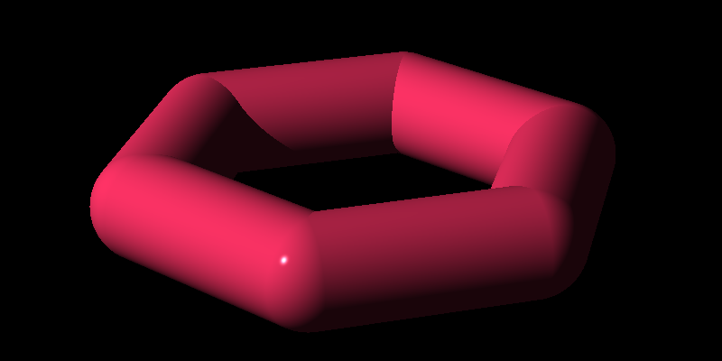

# Haskell Raytracer

This repo contains my work-in-progress code for implementing the raytracer described in the book [*The Raytracer Challenge*](https://pragprog.com/titles/jbtracer/the-ray-tracer-challenge/) by James Buck.

Currently I have implemented the code through chapter 14, groups, plus [the bonus chapter on area lights and soft shadows](http://raytracerchallenge.com/bonus/area-light.html).

## Directory structure:
- **src**: Contains the primary raytracer code
- **app**: Contains executables for the exercises at the end of each chapter
- **test**: Contains tests for library code
- **demo**: Contains examples of scenes rendered by the raytracer

## Rendered Examples:

### Soft Shadows

### Group Transformations

## TODO
- Triangles/Polygons/OBJ file parser
- Constructive Solid Geometry (CSG)
- YAML Scene parser