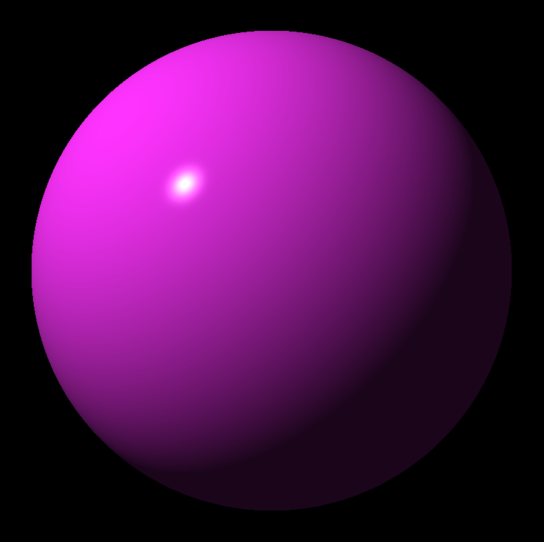
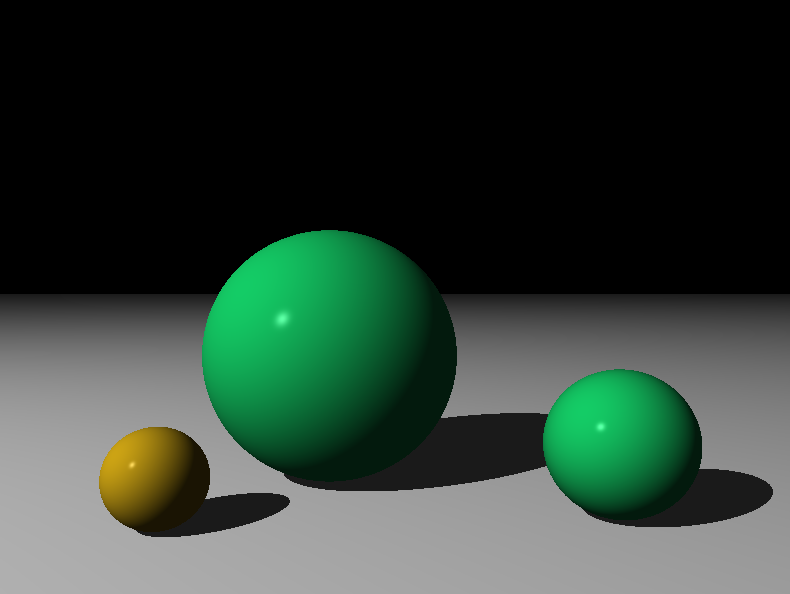
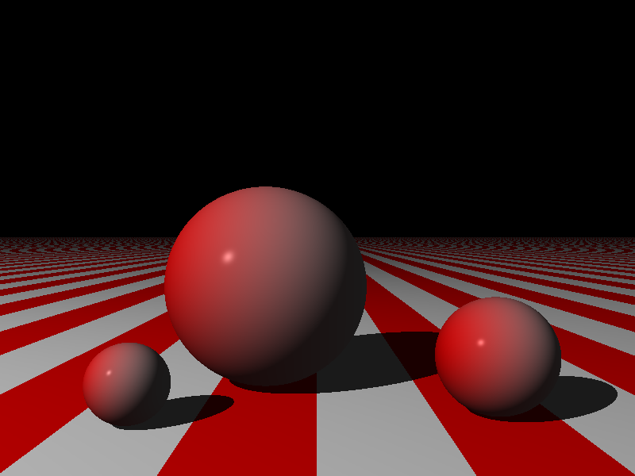
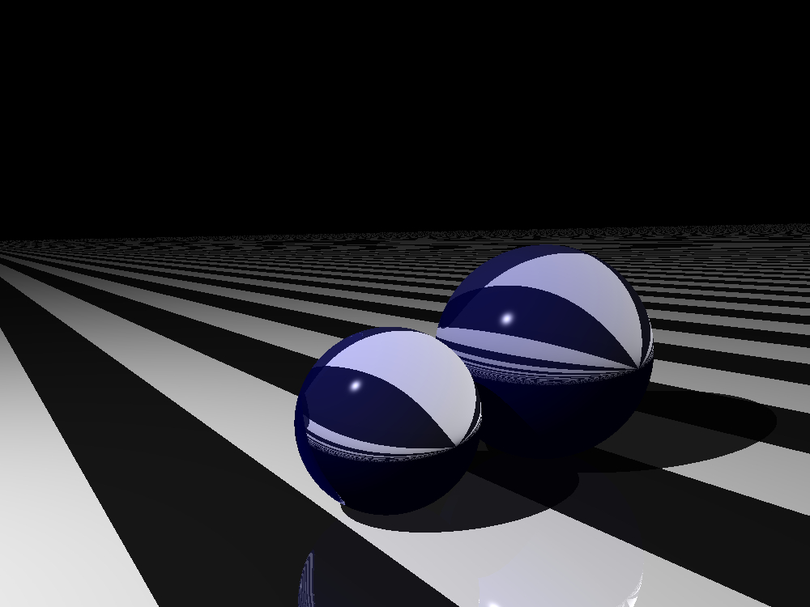

# Haskell Raytracer

This repo contains my work-in-progress code for implementing the raytracer described in the book *The Raytracer Challenge* by James Buck.

Currently I have implemented the code through chapter 9, planes.

## Directory structure:
- **src**: Contains the primary raytracer code
- **app**: Contains executables for the exercises at the end of each chapter
- **test**: Contains tests for library code
- **demo**: Contains examples of scenes rendered by the raytracer

## Rendered Examples:

